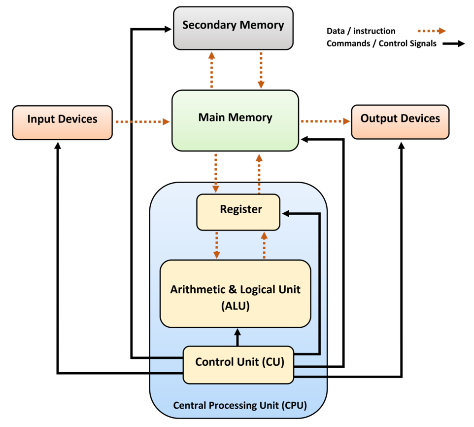

# 컴퓨터 연산

## 컴퓨터 구조 핵심 개요

|구성 요소|역할|
|---|---|
|CPU (Central Processing Unit)|명령어 해석, 연산 제어의 중심|
|CU (Control Unit)|명령어 디코딩 및 실행 흐름 제어|
|ALU (Arithmetic Logic Unit)|산술(+, -, *, /) 및 논리 연산 수행|
|레지스터(Register)|CPU 내부의 초고속 임시 저장 공간|
|메모리(RAM)|연산에 필요한 데이터 및 명령어 저장|
|버스(Bus)|데이터, 주소, 제어 신호 전송 통로 (Data Bus, Address Bus, Control Bus)|
 
## 명령어 처리 흐름 (Instruction Cycle)
모든 연산 명령어(ADD, SUB, MUL, DIV, ...)는 5단계의 공통 처리 흐름을 거칩니다.
CPU가 명령 1개 처리할 때 수행하는 세부 절차, 명령어 처리 5단계(Fetch → Decode → Operand Fetch → Execute → Store)

명령어 처리 5단계
1. Fetch (명령어 가져오기)
→ CU가 메모리에서 연산 명령어(ADD, SUB, MUL, DIV)를 가져옴

2. Decode (명령어 해석)
→ CU가 명령어를 해석하고, 연산 종류 및 대상 파악

3. Operand Fetch (피연산자 가져오기)
→ 연산에 필요한 값을 메모리에서 레지스터로 로드

4. Execute (연산 수행)
→ ALU가 연산을 이진수 형태로 계산

5. Store (결과 저장)
→ 결과를 다시 레지스터나 메모리에 저장

이 5단계는 모든 명령어에서 반복되며, 공통된 처리 흐름을 줄여서 공통 순서(Fetch - Decode - Execute)라고도 표현합니다.

## 덧셈과 뺄셈
- e.g. 1 + 1
- 레지스터 A ← 00000001
- 레지스터 B ← 00000001
- ALU가 A + B 수행 → 00000010
- ALU는 내부적으로 전가산기 회로를 통해 1비트씩 자리올림 처리하며 덧셈 수행
- 결과는 레지스터 또는 메모리에 저장

- e.g. 5 - 2
- 5 = 00000101
- 2 = 00000010 → 2의 보수 = 11111110
- ALU: 00000101 + 11111110 = 00000011 → 3
- 덧셈기 하나로 뺄셈도 처리 (2의 보수 덧셈 방식)

## 곱셈
- e.g. 2 * 3
- Shift & Add 방식 (2진수에서 시프트하며 누적 덧셈)
- 예: 10 * 11 = (10 << 1) + 10 = 110 (6)
- 속도를 위해 곱셈기 하드웨어 내장

## 나눗셈
- e.g. 4 / 2
- 나눗셈은 CPU 입장에서 가장 느린 연산
- 반복적 뺄셈 + 시프트 → 나누는 횟수 카운트
- Floating Point라면 Divide Unit 회로 사용
- 속도 저하로 인해 일부 CPU는 나눗셈 회로 생략하고 소프트웨어 구현 사용하기도 함